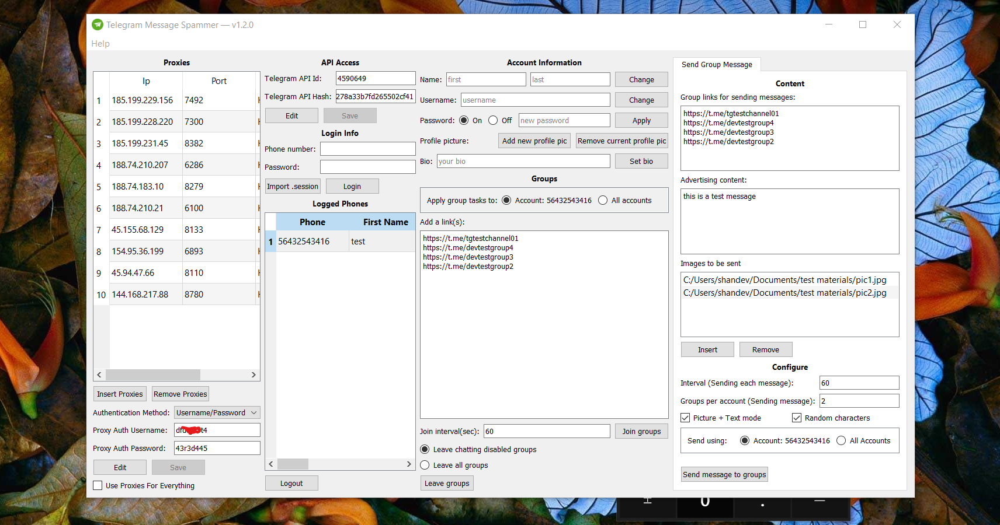
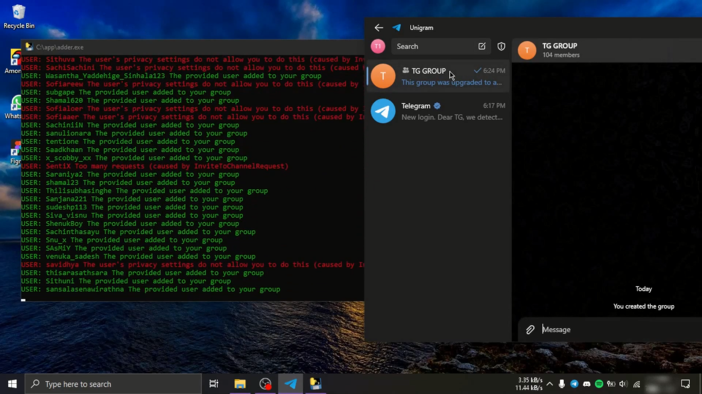
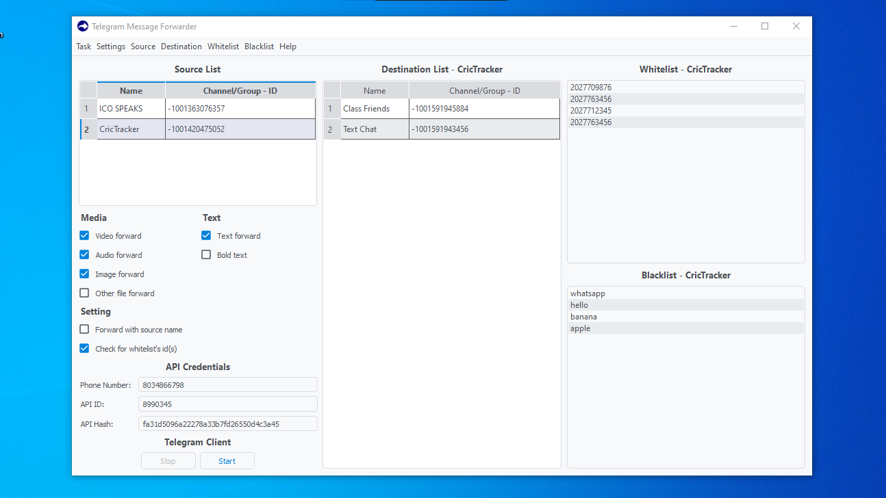
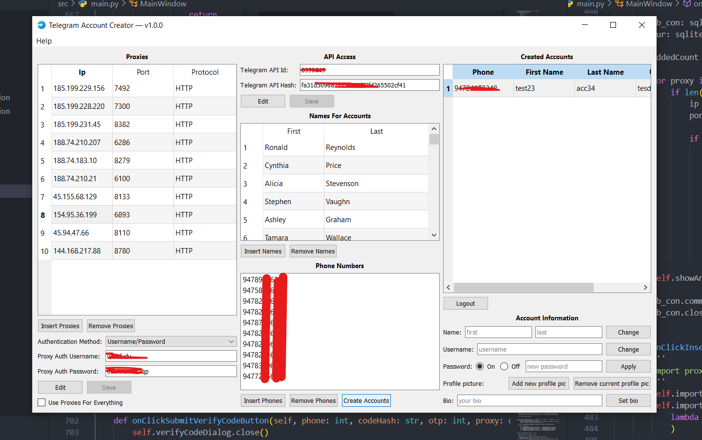

# Telegram Utilities

This repository contains several paid Telegram utilities that can be used for various Telegram-related tasks. All of these utilities were written in Python using the Telethon library. If you are interested in any of these tools or would like more details, please feel free to contact me.

## Contact me
- Telegram - [@phoenixdev28](https://t.me/phoenixdev28)

 

# Telegram Message Spammer

## What is this ❔
Introducing the ultimate Telegram assistant, an app designed to take your Telegram game to the next level! With this app, you can easily manage multiple Telegram accounts, effortlessly customizing their names, usernames, and profile pictures whenever you wish. The app also enables you to auto-join a list of groups, providing a seamless chatting experience.

Next up, you can send messages to a list of groups with just a few clicks. Plus, you can easily send messages with files or media, so you don't have to switch apps to share those hilarious memes or photos. Managing multiple accounts is also a breeze with this app, making it the perfect solution for social media managers and influencers.

The app also comes with the added benefit of avoiding being banned from Telegram - thanks to its advanced proxy feature. Additionally, you can send messages to users of groups and even scrape members easily.

Lastly, the app allows you to send reactions to posts in groups, adding a fun twist to your conversations. With all these features and more, this Telegram assistant is a must-have for anyone serious about managing their Telegram accounts. Give it a try today and experience the ultimate Telegram journey!

## Features
1. Change accounts info (Name, Username, Profile Picture)
2. Auto join to list of groups
3. Send messages to a list of groups
4. Send messages with files/media
5. Send messages using multiple accounts
6. Add proxies to avoid getting banned from telegram
7. Send message to users of groups
8. Scrape members
9. Send reactions to posts

## How to buy ❔
This can be used on windows. If you need to run this on a mac or a Linux please contact me before buying. If you have your specific requirements I can make the modifications according to that. The price of this tool would be $45. Contact me to buy.

 

# Telegram Group Members Adder

## What is this ❔
The Telegram Members Adder is a robust automation tool that allows users to efficiently add members to their Telegram groups and channels. With its advanced features, this Telegram Members Adder simplifies the process of gathering members from different groups and channels.

This tool allows you to auto-join and scrape multiple groups simultaneously. It's easy to use the scraper feature of the tool by inputting group links or choosing from the already joined groups. As a result, the process takes just a few minutes, saving a considerable amount of time.

Apart from this, you can add members to groups and channels quickly and easily. Using one or more accounts, the Telegram Members Adder enables users to efficiently manage members through easy-to-use interfaces, minimizing the risk of security and increasing the efficiency.

Using proxies is also an essential feature of this tool, which helps in masking the user's identity when using multiple accounts. With this adder, members can also be scraped and added based on their last seen. This feature not only allows you to focus on potential members more effectively, but it also makes it more accurate and fruitful.

Overall, Telegram Members Adder serves as a complete package of all the features you need to gather your Telegram community effortlessly and effectively.

## Features
1. Auto-join and Scrape multiple groups at the same time
2. Scrape using group links or joined groups
3. Add members to groups & channels
4. Add members with one or more accounts
5. Use proxies when using multiple accounts
6. Scrape members based on their last seen

## How to buy ❔
This can be used on windows If you need to run this on a mac or a Linux please contact me before buying. If you have your specific requirements I can make the modifications according to that. The price of this tool would be $30. Contact me to buy.

 

# Telegram Message Forwarder

## What is this ❔
Introducing the ultimate Telegram message forwarder app! This powerful tool allows you to easily manage your messages by allowing you to get messages from multiple groups and channels and forward them to multiple groups and channels.

Our app protects you from unwanted content by including a blacklisting feature - any messages that contain words on the blacklist won't be forwarded. Additionally, you have the flexibility to choose from which users you want to forward messages.

You can also filter the messages to only forward a certain type of media, making your message management a breeze.

The app also ensures consistency of forwarded content - if the source message is edited, the forwarded message will be updated accordingly. And if the source message is deleted, the forwarded message will also be deleted automatically.

Our Telegram message forwarder app is designed to make your life easier so you can focus on other things. Buy it today!

## Features
1. Get messages from multiple groups/channels
2. Forward messages to multiple groups/channels
3. Messages that contain words included in the blacklist won't be forwarded
4. When you forward messages you can choose from only which users you wanna forward messages
5. When forwarding messages you can choose which type of media should only be forwarded
6. If the source message got edited this app will edit the forwarded message too
7. If the source message got deleted this app will delete the forwarded message too

## How to buy ❔
This can be used on windows. If you need to run this on mac or Linux, please contact me before buying. If you have your specific requirements I can make the modifications according to that. The price of this tool would be $25. Contact me to buy.

 

# Telegram Account Creator

## What is this ❔
Introducing our latest Telegram Account Creator App! This app is especially designed for those who need multiple Telegram accounts for business or personal use. With this app, you can easily create Telegram accounts with just a click of a button.

Not only can you create accounts, but you can also customize them according to your liking. You have the power to change your account name, username, and bio as many times as you want. In addition, you can easily update your profile picture to keep your displayed image up-to-date.

To prevent getting banned, this app also allows you to use proxies. This feature ensures that your accounts stay safe and secure as you create them in batches.

Don't waste any more time with the hassle of creating Telegram accounts manually. Download this app today and take advantage of its powerful features to assist you in managing multiple Telegram accounts effortlessly.

## Features
1. Create telegram accounts
2. Change account name/username/bio
3. Change account profile picture
4. Use proxies when creating accounts to avoid getting banned

## How to buy ❔
This can be used on windows. If you need to run this on a mac or a Linux please contact me before buying. If you have your specific requirements I can make the modifications according to that. The price of this tool would be $35. Contact me to buy.